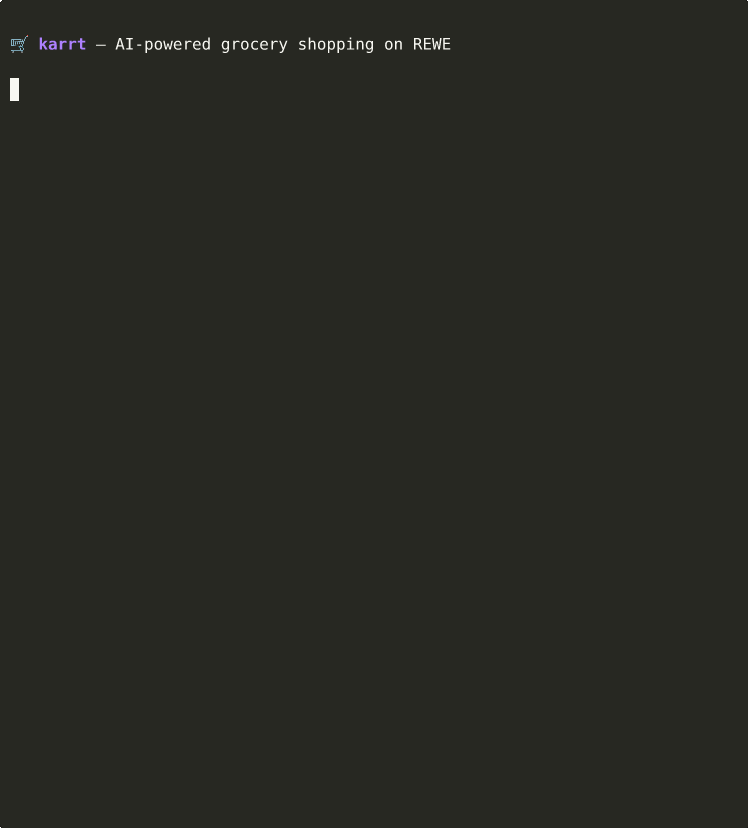

<p align="center">
  
</p>

<p align="center">
  A CLI for REWE grocery delivery ordering — designed for AI agent integration.
</p>

<p align="center">
  <a href="#installation">Installation</a> · <a href="#quick-start">Quick Start</a> · <a href="#commands">Commands</a> · <a href="#agent-skill">Agent Skill</a>
</p>

---

Search products, manage baskets, check timeslots, and place delivery orders from the terminal. All output is JSON, making it ideal for AI agents to parse and act on.

> **Disclaimer:** This is an **unofficial** project and is **not affiliated with, endorsed by, or connected to REWE Group or REWE digital** in any way. It interacts with REWE's public-facing web APIs, which are undocumented and may change at any time. **This tool may break without notice.** Use at your own risk.

## Demo

<p align="center">
  
</p>

## Requirements

- **Node.js** >= 18
- **Playwright** browsers (installed automatically)
- A **REWE account** with delivery enabled for your address
- A **2Captcha** account and API key (for solving Turnstile CAPTCHAs during login)
- **Linux** recommended (tested on Ubuntu). macOS should work but is untested.
- **X server or xvfb** — login opens a headed browser. On headless servers (VPS), install `xvfb` and prefix the login command with `xvfb-run`.

## Installation

```bash
git clone https://github.com/Tobi4s1337/karrt.git
cd karrt
npm install
npx playwright install chromium
npm run build
```

### 2Captcha Browser Extension Setup

The login flow uses a Chromium browser extension from [2Captcha](https://2captcha.com/) to automatically solve Cloudflare Turnstile challenges on the REWE login page.

1. **Get a 2Captcha account** at [2captcha.com](https://2captcha.com/) and add funds (a few dollars lasts a long time — each solve costs ~$0.002).

2. **Download the 2Captcha browser extension.** The upstream repo at `2captcha/solver_browser_extension` was archived, so use this mirror instead:
   ```bash
   git clone https://github.com/Tobi4s1337/2captcha-solver-mirror.git 2captcha-solver
   ```
   Alternatively, install from the [Chrome Web Store](https://chrome.google.com/webstore/detail/2captcha-solver/ifibfemgeogfhoebkmokieepdoobkbpo) and unpack the crx.

3. **Verify** that `2captcha-solver/manifest.json` exists at the project root after cloning.

4. **Configure the extension** by editing `2captcha-solver/common/config.js` and setting your API key:
   ```js
   const defaultConfig = {
     apiKey: 'YOUR_2CAPTCHA_API_KEY',
     // ...
   };
   ```

   Alternatively, launch the browser manually once, open the extension popup, and enter your API key there — it persists in the Chrome profile stored in `.chrome-data/`.

### Environment Variables

Set these for fully autonomous login (no manual interaction needed):

```bash
export REWE_EMAIL="your@email.com"
export REWE_PASSWORD="your-password"
```

### TOTP Setup (Recommended)

For fully autonomous 2FA, store your REWE account's TOTP secret:

```bash
node dist/cli.js totp-setup YOUR_BASE32_TOTP_SECRET
```

To get the TOTP secret:
1. Go to your REWE account security settings
2. Set up an authenticator app for 2FA
3. When shown the QR code, look for the "manual entry" option — that gives you the base32 secret
4. Enter it both in your authenticator app AND via `totp-setup`

With TOTP configured, `karrt login` is fully hands-free: it fills credentials, solves the CAPTCHA, and auto-generates the 2FA code.

## Quick Start

```bash
# 1. Find your local REWE delivery service
node dist/cli.js store search 66113

# 2. Set your store
node dist/cli.js store set 840254 66113

# 3. Log in (opens browser, solves CAPTCHA, handles 2FA)
node dist/cli.js login

# 4. Search for products
node dist/cli.js search "Vollmilch" --sort PRICE_ASC --category milch

# 5. Add to basket
node dist/cli.js basket add "8-Y4PWBC9S-d1125764-996e-3535-8619-eff4f86b672f"

# 6. Check timeslots
node dist/cli.js timeslots

# 7. Review checkout readiness
node dist/cli.js checkout status

# 8. Dry-run final review, then explicitly place the order
node dist/cli.js checkout place-order
node dist/cli.js checkout place-order --confirm "PLACE REWE ORDER"
```

## Commands

### Store Management

```bash
karrt store show                    # Show current store
karrt store search <zip>            # Find delivery service near ZIP code
karrt store set <wwIdent> <zip>     # Set active store
```

### Authentication

```bash
karrt login [--email X] [--password Y]   # Browser-based login
karrt verify <code>                       # Provide 2FA code (if TOTP not configured)
karrt login-status                        # Check login flow status
karrt import-cookies <file>               # Import cookies from Netscape file
karrt totp-setup <secret>                 # Store TOTP secret for auto-2FA
```

> **Headless server?** Login opens a real browser. On a VPS without a display, use:
> ```bash
> xvfb-run node dist/cli.js login
> ```
> Install xvfb first: `apt install xvfb`

### Product Search

```bash
karrt search <query> [options]
```

| Option | Description |
|--------|-------------|
| `--sort <order>` | `RELEVANCE_DESC`, `PRICE_ASC`, `PRICE_DESC`, `NAME_ASC`, `NAME_DESC` |
| `--category <slug>` | Filter by category (e.g., `milch`, `nudeln`, `gefluegelfleisch`) |
| `--page <n>` | Page number (default: 1) |
| `--per-page <n>` | Results per page (default: 40) |
| `--offers` | Only discounted items |
| `--organic` | Organic/Bio products |
| `--regional` | Regional products |
| `--vegan` | Vegan products |
| `--vegetarian` | Vegetarian products |

**Category slugs** constrain results to the right product type. Without them, a search for "Milch" might return shower gel. Common slugs:

| Category | Slug |
|----------|------|
| Milk | `milch` |
| Eggs | `eier-ei-ersatz` |
| Cheese (hard) | `hartkaese` |
| Cheese (fresh) | `frischkaese` |
| Poultry | `gefluegelfleisch` |
| Pork | `schweinefleisch` |
| Beef | `rindfleisch` |
| Bacon/Ham | `roher-schinken-speck` |
| Pasta | `nudeln` |
| Rice | `reis` |
| Fresh fruit | `frisches-obst` |
| Fresh vegetables | `frisches-gemuese` |
| Spices | `gewuerze` |
| Butter | `butter` |
| Bread | `brot` |

Slugs are kebab-case German category names (ä→ae, ö→oe, ü→ue). If a slug returns 404, check `categoryPath` in any search result to discover the correct one.

### Basket

```bash
karrt basket show                      # Show current basket
karrt basket add <listingId> [--qty N] # Add item
karrt basket update <listingId> <qty>  # Update quantity
karrt basket remove <listingId>        # Remove item
karrt basket clear                     # Clear all items
karrt basket bulk-add '<json>'         # Add multiple: '[{"listingId":"x","qty":1}]'
```

### Timeslots

```bash
karrt timeslots                     # List available delivery timeslots
karrt timeslot-reserve <slotId>     # Reserve a timeslot
```

Time-sensitive commands include a `now` field with the current local date/time (Europe/Berlin).

### Checkout

```bash
karrt checkout status               # Basket, minimum order, and timeslot readiness
karrt checkout review               # Final pre-order review data
karrt checkout place-order          # Dry-run the final review page only
karrt checkout place-order --confirm "PLACE REWE ORDER"  # Click Jetzt bestellen
```

`checkout place-order` opens the real REWE checkout in Chromium. Without the exact confirmation phrase it only verifies that the final review page is reachable and reports whether the `Jetzt bestellen` button is available. With `--confirm "PLACE REWE ORDER"`, it clicks the final order button.

### Orders

```bash
karrt orders show                   # List all orders
karrt orders get <orderId>          # Order details
karrt orders cancel <orderId>       # Cancel order
```

### Receipts

```bash
karrt receipts show                           # List digital receipts
karrt receipts download <receiptId> [--output] # Download PDF
```

### Suggestions

```bash
karrt suggestion <N>    # Suggest N items based on order history to reach free delivery
```

## Output Format

All commands output JSON. Add `-p` for pretty-printed output:

```bash
node dist/cli.js search "Banane" -p
```

Prices are in **cents** (e.g., `currentRetailPrice: 85` = 0.85 EUR).

## Agent Skill

Want an AI agent to do your grocery shopping? Install the [karrt agent skill](https://github.com/Tobi4s1337/karrt-skill):

```bash
npx skills add Tobi4s1337/karrt-skill
```

The skill works with [Claude Code](https://claude.ai/code), [Cursor](https://cursor.com), [Codex](https://openai.com/codex), and [40+ other agents](https://github.com/vercel-labs/skills#supported-agents) that support the Agent Skills spec.

## Session Management

Login creates a browser session stored in both `~/.config/karrt/session.json` and the persistent Playwright profile at `.chrome-data/`. Some basket requests are executed inside Chromium because REWE returns `400 Bad Request` for the same basket request when replayed from plain Node/curl.

All config is stored in `~/.config/karrt/`:
- `session.json` — Browser cookies
- `selected_store` / `selected_zip` — Current store
- `basket-id` — Active basket ID
- `totp-secret` — TOTP secret for 2FA
- `login-state.json` — Login flow IPC
- `.chrome-data/` — Persistent browser profile used by login and basket commands

## How It Works

- **Search** is public — no authentication needed
- **Basket commands** use the persistent Chromium profile so the request is sent from the same browser context as rewe.de
- **Orders, receipts, favorites, and timeslots** use the stored API session
- **Checkout commands** report readiness, dry-run the final review page, and place orders only with an exact confirmation phrase
- Login uses **Playwright** with stealth plugins to automate the REWE login page
- **Turnstile CAPTCHA** is solved by the 2Captcha browser extension running inside Chromium
- The login page sometimes shows a "continue with remembered account" prompt instead of the login form — both flows are handled automatically
- Cookies are extracted from the browser and reused for normal API calls

## Known Limitations

- Some API sessions expire frequently (~10 min) — re-run `karrt login` if non-basket commands return 401/403
- The 2Captcha extension needs a few seconds to solve each CAPTCHA
- Order placement relies on REWE's browser checkout flow and may break if REWE changes the page
- Only REWE delivery is supported
- Category slugs may change if REWE reorganizes their product categories

## License

MIT
